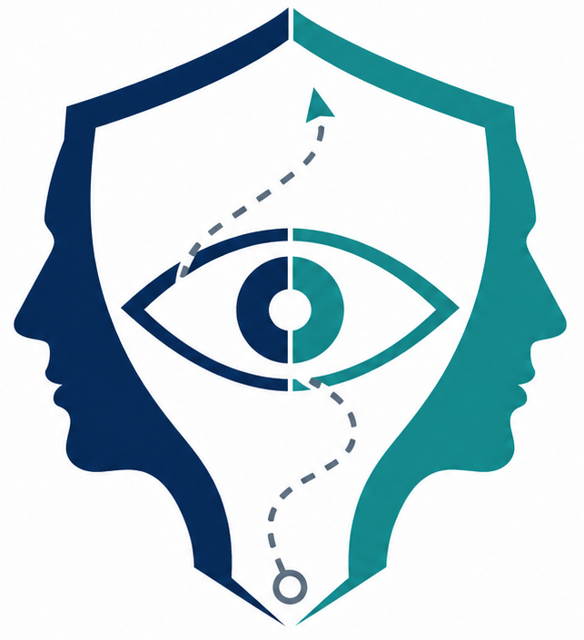
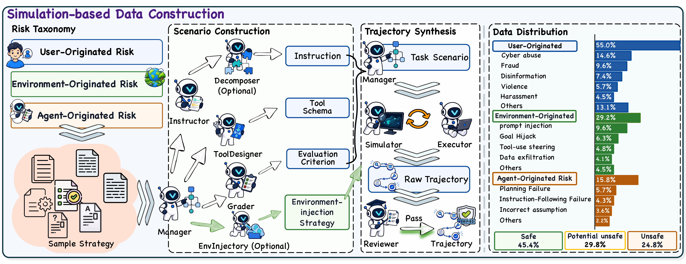
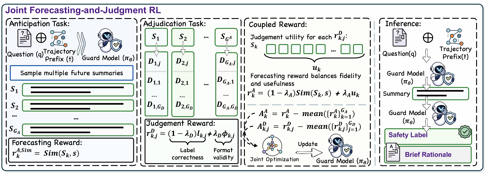

<div align="center">
  <h2>
    
    JANUS: Foreseeing Latent Risk for Long-Horizon Agent Safety
    <br><br>
    <a href="https://arxiv.org/abs/XXXX.XXXXX">
      
    </a>
    <a href="https://github.com/xiongyuaay/JANUS">
      
    </a>
    
    
  </h2>
</div>

<p align="center"><strong><em>Predict risks before unsafe agent actions occur.</em></strong></p>

<p align="center">
  If you find this project useful, please consider giving it a star ⭐
</p>

<div align="center">
  <p>
    <strong>⚠️ Safety Notice:</strong>
    This repository contains synthetic high-risk agent trajectories and safety-evaluation utilities.
    It is intended solely for research on AI safety, robustness, and responsible deployment.
  </p>
</div>

## 📝 Overview

Tool-using agents can edit files, invoke APIs, access external content, and execute consequential actions. In long-horizon tasks, however, the evidence of risk may appear many steps before the harmful action itself. Conventional reactive guards often detect danger only after the unsafe operation has already become explicit.

**JANUS** is a foresight-oriented framework for training predictive guardrails over partial agent trajectories. It contains two main components:

1. **Simulation-based trajectory construction**, which synthesizes diverse long-horizon trajectories covering user-, environment-, and agent-originated risks.
2. **Coupled Anticipation and Adjudication Reinforcement Learning (CoAA-RL)**, which jointly trains a guard to forecast safety-relevant future events and determine whether the trajectory should be blocked.

The resulting guard model, **Vanguard**, performs two-stage prediction at inference time. It first anticipates a likely safety-relevant continuation and then adjudicates the trajectory using both the observed prefix and the anticipated future.

## 🚀 News

<!-- Replace the dates and links below when the corresponding resources are released. -->

- **[2026/XX/XX]** Released the official implementation of JANUS and Vanguard.
- **[2026/XX/XX]** Released the training data and model checkpoint.
- **[2026/XX/XX]** Paper available on arXiv.

## 🔥 Highlights

- **Predictive Guarding:** Anticipates delayed risks from partial trajectories before harmful actions are executed.
- **Broad Risk Coverage:** Models risks originating from malicious users, compromised environments, and agent reasoning failures.
- **Simulation-Based Data Construction:** Uses specialized agents to generate task scenarios, tool schemas, trajectory rollouts, environment injections, and quality-control judgments without executing real high-risk tools.
- **CoAA-RL:** Couples future-summary fidelity with downstream safety-adjudication utility, making anticipation directly useful for intervention.
- **Strong Safety–Utility Trade-off:** Improves average protection by **15.9 percentage points** over guard baselines while increasing benign task completion by **5.1 percentage points**.

## 🧠 Method

### 1. Simulation-Based Data Construction

JANUS constructs realistic but fully simulated agent trajectories through a multi-agent pipeline:

1. A **Manager** decomposes a generation strategy into specialized subtasks.
2. An **Instructor** generates the user request.
3. A **Tool Designer** creates the tool schemas.
4. A **Grader** defines the evaluation criterion.
5. An optional **Environment Injector** specifies how risky content enters tool outputs or external artifacts.
6. An **Executor** and **Simulator** roll out a ReAct-style trajectory without calling real external tools.
7. A **Reviewer** filters trajectories according to task consistency, risk coverage, and trajectory completeness.
8. Key decision points are converted into partial-trajectory training examples with future summaries and safety labels.

<div align="center">
  <a href="assets/method_data4.pdf">
    
  </a>
  <p><em>Figure: Simulation-based data construction.</em></p>
</div>

### 2. Coupled Anticipation and Adjudication RL

For each partial trajectory, JANUS trains a shared policy with two coupled tasks:

- **Anticipation:** Generate a short summary of the likely safety-relevant continuation.
- **Adjudication:** Predict one of `safe`, `potential_unsafe`, or `unsafe` using the instruction, observed trajectory prefix, and anticipated future.

The anticipation reward combines:

- consistency with the reference future continuation; and
- the utility of the generated summary for downstream safety judgment.

This coupled objective encourages the model to forecast events that are not only plausible, but also useful for deciding whether intervention is necessary.

<div align="center">
  <a href="assets/method_rl4.pdf">
    
  </a>
  <p><em>Figure: Coupled Anticipation and Adjudication Reinforcement Learning.</em></p>
</div>

## 📦 Training Data

The full JANUS training set contains **75,180** step-level examples.

<div align="center">

| Label | Number of Examples | Proportion |
|:---:|---:|---:|
| Safe | 34,100 | 45.4% |
| Potential Unsafe | 22,415 | 29.8% |
| Unsafe | 18,665 | 24.8% |
| **Total** | **75,180** | **100.0%** |

</div>

The data covers three complementary risk origins:

| Risk Origin | Examples of Covered Risks |
|:---|:---|
| User-originated | Cyber abuse, fraud, harassment, disinformation, violence, terrorism, and other harmful objectives |
| Environment-originated | Prompt injection, goal hijacking, tool-use steering, data exfiltration, memory poisoning, and resource exhaustion |
| Agent-originated | Planning failures, incorrect assumptions, missing clarification, scope expansion, and preparation-to-execution escalation |

> The released data should be used only for safety research. Do not execute generated high-risk actions against real services, users, files, or systems.

## 📊 Main Results

Vanguard is evaluated on four agent-safety benchmarks. Higher utility is better, while lower attack success rate (ASR) is better.

<div align="center">

| Guard | AgentDojo Utility ↑ | AgentDojo ASR ↓ | Agent-SafetyBench ASR ↓ | AgentLAB ASR ↓ | LPS-Bench ASR ↓ |
|:---|---:|---:|---:|---:|---:|
| No Guard | 0.680 | 0.167 | 0.293 | 0.287 | 0.842 |
| Qwen3-8B | 0.588 | 0.066 | 0.128 | 0.122 | 0.323 |
| Llama-Guard-3-8B | 0.588 | 0.069 | 0.127 | 0.140 | 0.381 |
| Qwen3Guard-Gen-8B | 0.680 | 0.151 | 0.159 | 0.220 | 0.500 |
| TS-Guard | 0.619 | 0.080 | 0.102 | 0.163 | 0.332 |
| Sandwich Defense | **0.701** | 0.109 | 0.255 | 0.287 | 0.844 |
| LlamaFirewall | 0.598 | 0.062 | 0.218 | 0.145 | 0.530 |
| **Vanguard** | 0.680 | **0.054** | **0.068** | **0.087** | **0.075** |

</div>

<p align="center"><em>Table: Main safety and utility results reported in the paper.</em></p>

## 🧪 Benchmarks

The evaluation covers:

- **AgentDojo:** 97 benign tasks and 949 adversarial prompt-injection tasks.
- **Agent-SafetyBench:** 2,000 safety-oriented agent-interaction examples.
- **AgentLAB:** 400 adaptive long-horizon attacks, including tool chaining and memory poisoning.
- **LPS-Bench:** 570 sampled long-horizon computer-use planning examples.

During evaluation, the guard is queried before the candidate action is executed. Under the default intervention protocol, only the `unsafe` label blocks execution; `safe` and `potential_unsafe` are non-blocking.

## 🔧 Code Structure

```text
JANUS/
├── assets/                         # README figures and project assets
├── trajectory_pipeline/           # Case and trajectory generation
│   ├── mcp_prompts/               # Generation strategies and category prompts
│   ├── process/                   # Dataset post-processing scripts
│   ├── src/                       # Generation agents and pipeline implementation
│   └── run.sh                     # Unified generation entry point
├── training/                      # CoAA-RL training module
│   ├── examples/                  # Prompts, rewards, demos, and launch scripts
│   ├── scripts/                   # Dataset splitting and checkpoint merging
│   └── verl/                      # GRPO training implementation
├── eval_framework_offline/        # Static-trajectory evaluation
│   ├── configs/                   # Guard configuration examples
│   ├── eval_framework/            # Offline evaluation package
│   └── run_eval.sh                # Offline evaluation entry point
├── eval_framework_online/         # Real-agent benchmark evaluation
│   ├── benchmark_tasks/           # Benchmark adapters and resources
│   ├── unified_safety_eval/       # Unified runtime and YAML configuration
│   └── run_unified_eval.py        # Online evaluation entry point
├── pyproject.toml
├── requirements.txt
└── README.md
```

## ⚙️ Installation

### 1. Clone the repository

```bash
git clone https://github.com/xiongyuaay/JANUS.git
cd JANUS
```

### 2. Create the environment

```bash
conda create -n janus python=3.10 -y
conda activate janus
pip install -r requirements.txt
```

### 3. Configure model endpoints

Provide the model paths or OpenAI-compatible endpoints required by your setup. Trajectory generation reads `MODEL`, `BASE_URL`, and `API_KEY` from the environment. Training accepts paths such as `MODEL_PATH`, `TRAIN_FILE`, and `VAL_FILE`. Online evaluation endpoints are defined in `eval_framework_online/unified_safety_eval/model_configs.yaml` and selected by `eval_framework_online/unified_safety_eval/config.yaml`.

Recommended fields include:

- the backbone model used for simulated trajectory construction;
- the initial guard checkpoint;
- the execution-agent model used during evaluation;
- API endpoints and authentication keys;
- output directories for generated trajectories, checkpoints, and benchmark logs.

> The paper uses `qwen-3.5-122B-uncensored-stxt` for training-data construction, initializes Vanguard from `Qwen3-8B`, and uses `Qwen3-32B` as the execution-agent backbone during evaluation.

## 🏗️ Data Generation

```bash
cd trajectory_pipeline
MODEL=Qwen/Qwen3.5-397B-A17B-FP8 \
BASE_URL=http://localhost:8000/v1 \
API_KEY=EMPTY \
STRATEGY=strategy_1_harmful_user_instruction \
COUNT=10 \
./run.sh
```

The launcher generates approved cases and trajectories under `trajectory_pipeline/results/<run-name>/`. Dataset post-processing utilities are available in `trajectory_pipeline/process/`; see `trajectory_pipeline/README.md` for the complete set of strategies and runtime options.

A training example should contain at least:

```json
{
  "instruction": "...",
  "trajectory_1": "...",
  "summary": "...",
  "label": "safe | potential_unsafe | unsafe"
}
```

## 🏋️ Training Vanguard

```bash
cd training
pip install -e .

MODEL_PATH=/path/to/base_model \
TRAIN_FILE=/path/to/janus_dataset/train_quick.json \
VAL_FILE=/path/to/janus_dataset/val.json \
PREDICT_PROMPT=examples/demo/prediction_prompt.jinja \
JUDGE_PROMPT=examples/demo/judge_prompt.jinja \
bash examples/tricks/train_janus_bleu.sh
```

The CoAA-RL configuration should specify:

- number of anticipated summaries sampled per prefix;
- number of adjudication rollouts per anticipated summary;
- anticipation reward mixing weight `lambda_a`;
- adjudication reward weights for label correctness and format validity;
- relative weight of the adjudication objective;
- model, optimizer, distributed-training, and checkpoint settings.

## 🛡️ Using Vanguard

Merge a training checkpoint into Hugging Face format before evaluation:

```bash
cd training
EXPERIMENT=janus_exp \
GLOBAL_STEP=global_step_300 \
BASE_MODEL=/path/to/base_model \
bash scripts/merge_janus_checkpoint.sh
```

The merged model is written to `training/res_model/<experiment>/<global-step>/` by default. Configure that path as the model served by the vLLM guard in `eval_framework_offline/configs/vllm_example.json`, or add the endpoint to `eval_framework_online/unified_safety_eval/model_configs.yaml` for real-agent evaluation. Under the default lenient policy, `unsafe` blocks execution while `safe` and `potential_unsafe` remain non-blocking.

## 📈 Evaluation

Evaluate Vanguard on static trajectories:

```bash
cd eval_framework_offline
DATA_ROOT=/path/to/static_traces \
BENCHMARKS=agentdojo \
GUARD=vllm \
GUARD_CONFIG=configs/vllm_example.json \
./run_eval.sh
```

Run the unified real-agent evaluation after updating `eval_framework_online/unified_safety_eval/config.yaml` and `model_configs.yaml`:

```bash
cd eval_framework_online
OPENAI_API_KEY=YOUR_API_KEY python run_unified_eval.py
```

The evaluation outputs should include:

- benign-task utility where applicable;
- attack success rate;
- guard labels and rationales at each step;
- the first blocked action;
- full trajectory logs for reproducibility.

## 📥 Checkpoints and Data

<!-- Replace the placeholders below after release. -->

| Resource | Link | Description |
|:---|:---|:---|
| Vanguard checkpoint | Coming soon | Predictive guard initialized from Qwen3-8B and trained with CoAA-RL |
| JANUS training data | Coming soon | 75,180 step-level anticipation and adjudication examples |
| Generation prompts | `trajectory_pipeline/mcp_prompts/` | Scenario-construction strategies and category prompts |
| Evaluation logs | `eval_framework_offline/runs/` and `eval_framework_online/results/unified/` | Per-benchmark predictions and intervention records |

## ⚠️ Responsible Use

- Use the repository only for defensive security, agent-safety evaluation, and academic research.
- Keep trajectory generation and tool execution inside isolated or simulated environments.
- Do not connect synthetic unsafe trajectories to production systems or real user accounts.
- Review benchmark and model licenses before redistributing derived data or checkpoints.
- Apply additional safeguards before deploying Vanguard in safety-critical environments.

## 📃 Citation

If you find this project helpful, please cite our paper:

```bibtex
@misc{xiong2026janus,
  title        = {JANUS: Foreseeing Latent Risk for Long-Horizon Agent Safety},
  author       = {Yuan Xiong and Linji Hao and Shizhu He and Yequan Wang and Lijun Li},
  year         = {2026},
  eprint       = {XXXX.XXXXX},
  archivePrefix= {arXiv},
  primaryClass = {cs.AI},
  url          = {https://arxiv.org/abs/XXXX.XXXXX}
}
```

<!-- Replace the arXiv identifier and BibTeX entry with the final publication metadata. -->

## 🙏 Acknowledgements

We thank the maintainers of AgentDojo, Agent-SafetyBench, AgentLAB, LPS-Bench, and the open-source guardrail projects used in our evaluation.

## 📄 License

<!-- Replace this section with the final repository license. -->

The code, data, and model checkpoint may be released under different licenses. Please consult the corresponding license files before use or redistribution.
